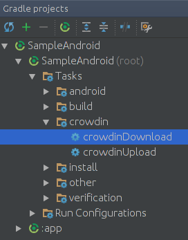

Gradle Crowdin Plugin
----

This Gradle plugin adds tasks to upload and download translation files from crowdin.com

`crowdinDownload` downloads the latest translations and `crowdinUpload` uploads a source file. 

## Usage

Add this to your build.gradle:

    plugins {
      id "com.mendhak.gradlecrowdin" version "0.0.8"
    }

For pre-Gradle-2.1, follow the [instructions here](https://plugins.gradle.org/plugin/com.mendhak.gradlecrowdin)

## Download task

For download, the plugin invokes an export of your project's translations and then downloads the translations in a zip file. 
It then unzips and copies to the given destination.

    crowdinDownload{
        apiKey = "31727f222f203349979cf710a471b767"
        destination = "$projectDir/src/main/res"
        projectId = 'my-test-project'
    
        //Optional
        //Android projects
        renameMapping  = [
            from:  '^(.*)/(.*)$',
            to:  /values-\1\/\2/
        ]
        //Optional
        excludePattern = '**/*.txt'
    }

In some cases you may want to modify the structure as it's copied over.  
For example, Android projects would use `values-es` instead of `es`.  You can use the `renameMapping` option to do this.
 
You may also want to exclude certain files, you can do this using `excludePattern`.

## Android download task

Crowdin gives `ru` files as well as `pt-BR` files.  You can get them both with two tasks.

      task crowdin1(group:"crowdin", type:com.mendhak.gradlecrowdin.DownloadTranslationsTask){
    
                apiKey = CROWDIN_API_KEY
                destination = "$projectDir/src/main/res"
                projectId = 'gpslogger-for-android'
    
                //Android projects
                renameMapping = [
                        from: '^([^-]*)/strings.xml$',
                        to  : /values-\1\/strings.xml/
                ]
    
                excludePattern = '**/*.txt'
        }
    
        task crowdin2(group:"crowdin", type:com.mendhak.gradlecrowdin.DownloadTranslationsTask, dependsOn:"crowdin1"){
    
            apiKey = CROWDIN_API_KEY
            destination = "$projectDir/src/main/res"
            projectId = 'gpslogger-for-android'
    
            //Android projects
            renameMapping = [
                    from: '^([^-]*)-([^-]*)/strings.xml$',
                    to  : /values-\1-r\2\/strings.xml/
            ]
    
            excludePattern = '**/*.txt'
        }

And then call it like so

    task getallTranslations(group:"crowdin", dependsOn:"crowdin2")  {    }

As an alternative you can go to the file settings on crowdin and set the resulting file name to something similar to `/app/src/main/res/values-%android_code%/strings.xml`. Crowdin will then automatically generate the appropriate file structure inside the downloaded zip file. In the example file name you would have to also adjust the destination to `"$projectDir"`.

## Upload task

Point this at your source file, such as `values/strings.xml` and the task will update it on crowdin. 

    crowdinUpload {
        apiKey = "31727f222f203349979cf710a471b767"
        projectId = 'my-test-project'
        sourceFiles = [
            ['strings.xml', "$projectDir/src/main/res/values/strings.xml"]
        ]
    }

Note that the file must exist on crowdin, this simply acts as an updater.  New files are not created. 
The sourceFiles expects a list of tuples where the first entry referrs to the file name used on crowdin and the second to the corresponding file in your project. This also allows you to batch upload strings.xml files from separate modules.
 
## Screenshot
 
In IDEA, the task should appear under the category crowdin as shown here

## Building

To build, run the uploadArchives task under upload.  This doesn't actually upload it anywhere, it just copies it to the 'repo' folder.
 
To reference it in another project locally, modify the gradle file to look like so:
 
    buildscript {
        repositories {
        mavenCentral()
                maven {
                    url uri('/home/mendhak/Code/gradle-crowdin-plugin/plugin/repo')
                }
        }
        dependencies {
            classpath 'com.mendhak.gradlecrowdin:crowdin-plugin:0.0.7'
        }
    }
    
    apply plugin: 'com.mendhak.gradlecrowdin'
